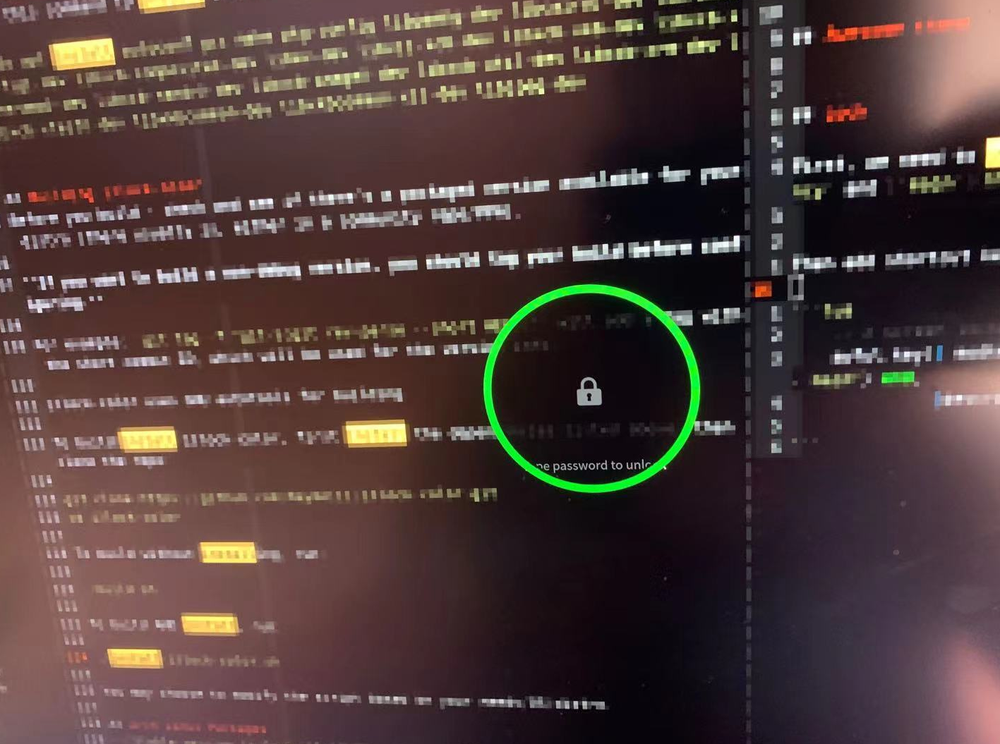
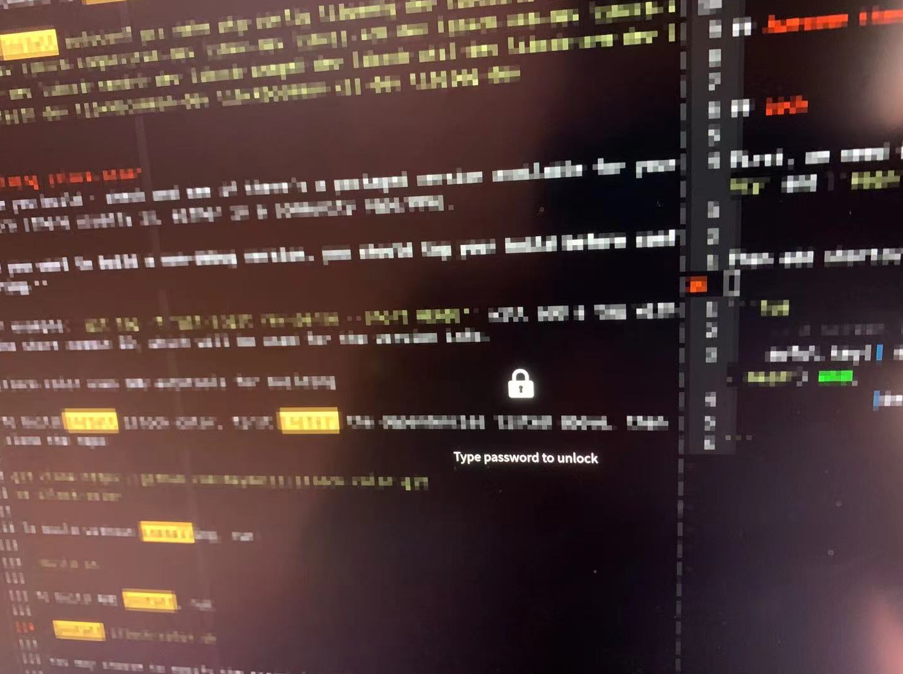

# Awesome WM

This configuration base on [lcpz/awesome-copycats](https://github.com/lcpz/awesome-copycats). Keep my original shortcut keys and operating habits.
Added some additional configuration.


## Awesome theme

This is based on [lcpz/awesome-copycats](https://github.com/lcpz/awesome-copycats) and only using `powerarrow` theme.

Just move this derectory to `~/.config/awesome` the restart awesome.


## Lock

First, we need to install some dependencies, such as: `i3lock-color`, `i3lock-fancy` and [`maim`](https://github.com/naelstrof/maim) as screenshot tool.


Then add shortcut keys.

```lua
    -- X screen locker
    awful.key({ modkey, altkey }, "l", function () os.execute("i3lock-fancy -p -- maim") end,
              {description = "lock screen", group = "hotkeys"}),

```

It looks like this:




